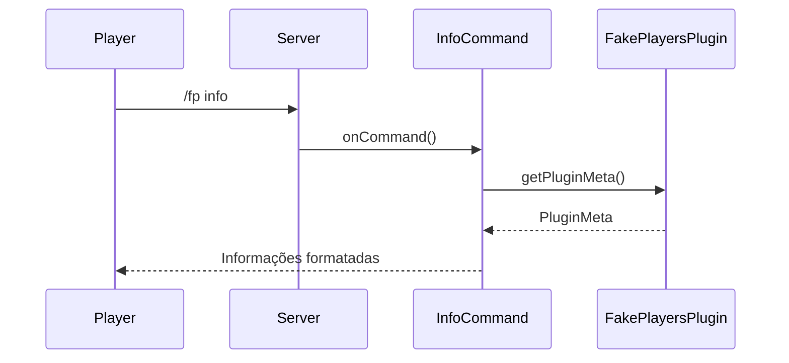
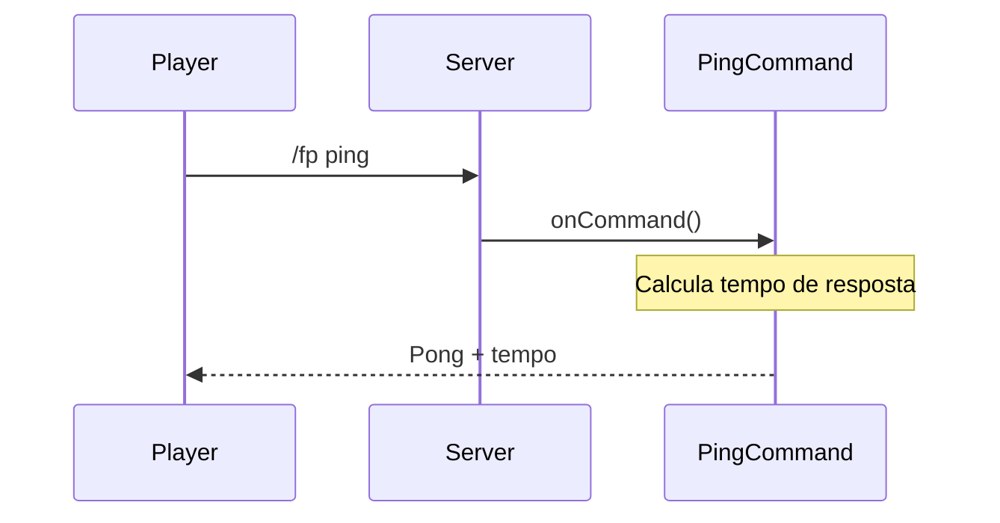
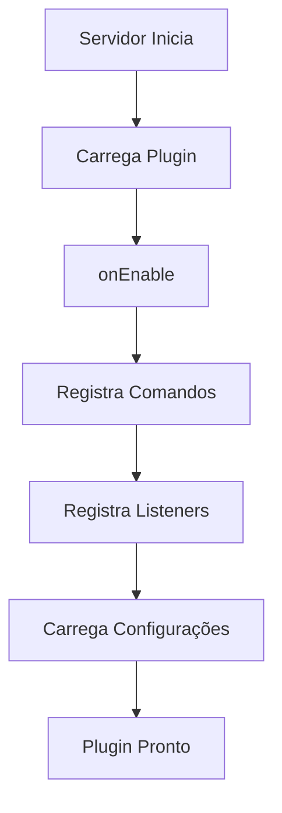

# Documentação Técnica - FakePlayers

## 📚 Referências e Recursos

### Java e Minecraft
- [Documentação Oficial do Java](https://docs.oracle.com/javase/21/docs/)
- [Java Design Patterns](https://refactoring.guru/design-patterns/java)
- [Minecraft Wiki](https://minecraft.fandom.com/wiki/Minecraft_Wiki)
- [Paper API Documentation](https://docs.papermc.io/paper/dev/getting-started)
- [Bukkit API Documentation](https://hub.spigotmc.org/javadocs/bukkit/)

### Ferramentas e Frameworks
- [Gradle Documentation](https://docs.gradle.org/current/userguide/userguide.html)
- [Adventure API Documentation](https://docs.adventure.kyori.net/)
- [Paper Plugin Development](https://docs.papermc.io/paper/dev/getting-started/paper-plugins)

### Boas Práticas
- [Clean Code Principles](https://www.cleancodeconcepts.com/)
- [SOLID Principles](https://www.baeldung.com/solid-principles)
- [Minecraft Plugin Best Practices](https://docs.papermc.io/paper/dev/getting-started/paper-plugins#best-practices)

## 🏗️ Arquitetura do Projeto

### Estrutura de Pacotes
```
FakePlayers/
├── src/
│   └── main/
│       ├── java/
│       │   └── app/
│       │       └── adriano/
│       │           └── fakeplayers/
│       │               ├── FakePlayersPlugin.java
│       │               ├── commands/
│       │               │   ├── InfoCommand.java
│       │               │   ├── PingCommand.java
│       │               │   └── ReloadCommand.java
│       │               ├── config/
│       │               │   └── ConfigManager.java
│       │               └── listeners/
│       │                   ├── BaseListener.java
│       │                   ├── TestListener.java
│       │                   └── package-info.java
│       └── resources/
│           ├── paper-plugin.yml
│           └── config.yml
└── build.gradle
```

### Componentes Principais

#### Sistema de Configuração (v0.1.4)
O `ConfigManager` é o componente central do sistema de configuração:

1. **Funcionalidades**:
   - Carregamento/salvamento de configurações
   - Recarregamento em tempo real
   - Conversão de cores automática
   - Sistema de debug integrado

2. **Métodos Principais**:
   ```java
   public String getString(String path, String defaultValue)
   public boolean getBoolean(String path, boolean defaultValue)
   public void debug(String message)
   public boolean reloadConfig()
   ```

3. **Uso do Debug**:
   ```java
   configManager.debug("Mensagem de debug");
   ```

4. **Exemplo de Configuração**:
   ```yaml
   general:
     debug: true
     prefix: "&a[FakePlayers] &r"
   ```

#### Sistema de Cores (v0.1.4)
Implementação robusta de cores usando a API do Bukkit:

1. **Códigos de Cores**:
   - Básicas: `&0` a `&9`
   - Extras: `&a` a `&f`
   - Formatação: `&l`, `&n`, `&o`, etc.

2. **Processo de Conversão**:
   ```java
   ChatColor.translateAlternateColorCodes('&', text)
   ```

3. **Uso em Mensagens**:
   ```yaml
   messages:
     info: "&aInformações do plugin:"
     error: "&cErro: &f%message%"
   ```

#### Sistema de Debug (v0.1.4)
Implementação de logs detalhados para diagnóstico:

1. **Configuração**:
   ```yaml
   general:
     debug: true
   ```

2. **Níveis de Log**:
   - Inicialização de componentes
   - Execução de comandos
   - Eventos do servidor
   - Operações de configuração

3. **Formato de Mensagens**:
   ```
   [FakePlayers] [DEBUG] mensagem
   ```

### Diagramas de Sequência

#### Comando /fp info


#### Comando /fp ping


### Fluxogramas

#### Fluxo de Execução do Plugin


### Padrões de Design Utilizados
1. **Singleton**: Para a classe principal do plugin
   - Garante uma única instância do plugin
   - Facilita acesso global às configurações
   - Implementado através do `JavaPlugin`

2. **Command Pattern**: Para implementação de comandos
   - Separa a lógica de execução dos comandos
   - Facilita adição de novos comandos
   - Implementa `CommandExecutor` e `TabCompleter`

3. **Observer Pattern**: Para listeners de eventos
   - Permite reação a eventos do servidor
   - Desacopla a lógica de eventos
   - Implementa interface `Listener`

4. **Factory Pattern**: Para criação de Fake Players (futuro)
   - Centraliza a criação de objetos
   - Facilita extensão e manutenção
   - Será implementado na versão 0.2.x

## 🔧 Detalhes Técnicos

### Importações do Projeto
O plugin utiliza diversas bibliotecas e APIs. Aqui está um guia detalhado das importações:

#### Paper/Bukkit API
```java
import org.bukkit.command.Command;              // Classe base para comandos
import org.bukkit.command.CommandExecutor;      // Interface para executar comandos
import org.bukkit.command.CommandSender;        // Representa quem enviou o comando
import org.bukkit.command.TabCompleter;         // Interface para sugestões de comandos
import org.bukkit.plugin.java.JavaPlugin;       // Classe base para plugins
import org.bukkit.event.Listener;               // Interface para listeners de eventos
import org.bukkit.ChatColor;                    // Utilitário para cores no chat
```
- **Origem**: Paper/Bukkit API
- **Uso**: Funcionalidades básicas do servidor Minecraft
- **Documentação**: [Paper API Docs](https://docs.papermc.io/paper/dev/getting-started)

#### Adventure API (Textos e Componentes)
```java
import net.kyori.adventure.text.Component;           // Sistema moderno de texto
import net.kyori.adventure.text.format.NamedTextColor; // Cores predefinidas
```
- **Origem**: Adventure API (KyoriPowered)
- **Uso**: Sistema moderno de formatação de texto
- **Documentação**: [Adventure API Docs](https://docs.adventure.kyori.net/)

#### Java Standard
```java
import java.io.File;                    // Manipulação de arquivos
import java.io.IOException;             // Tratamento de erros de I/O
import java.io.InputStream;             // Leitura de dados
import java.io.InputStreamReader;        // Leitura de texto
import java.nio.charset.StandardCharsets; // Codificação de caracteres
import java.util.logging.Level;          // Níveis de log
```
- **Origem**: Java Standard Library
- **Uso**: Operações básicas de I/O e sistema
- **Documentação**: [Java API Docs](https://docs.oracle.com/javase/21/docs/)

#### Configuração
```java
import org.bukkit.configuration.file.FileConfiguration; // Base para configs
import org.bukkit.configuration.file.YamlConfiguration; // Configs em YAML
```
- **Origem**: Bukkit API
- **Uso**: Sistema de configuração em YAML
- **Documentação**: [Bukkit Configuration](https://hub.spigotmc.org/javadocs/bukkit/org/bukkit/configuration/file/FileConfiguration.html)

#### Pacotes do Plugin
```java
import app.adriano.fakeplayers.FakePlayersPlugin;     // Classe principal
import app.adriano.fakeplayers.commands.*;            // Comandos
import app.adriano.fakeplayers.config.ConfigManager;  // Gerenciador de config
import app.adriano.fakeplayers.listeners.*;           // Listeners
```
- **Origem**: Próprio plugin
- **Uso**: Organização do código em pacotes
- **Estrutura**: Segue padrões de design Java

### Versões e Dependências
- Java: 21
- Paper API: 1.21.4
- Gradle: 8.x
- Adventure API: 4.x

### Configurações
- `paper-plugin.yml`: Configurações básicas do plugin
- `build.gradle`: Configurações de build e dependências
- `config.yml`: Configurações do plugin (futuro)

### Comandos
- `/fp info`: Mostra informações detalhadas sobre o plugin
- `/fp ping`: Testa a latência do servidor e do plugin
- `/fp reload`: Recarrega as configurações do plugin

### Permissões
- `fakeplayers.use`: Permissão base para usar comandos
- `fakeplayers.info`: Permissão para usar o comando info
- `fakeplayers.ping`: Permissão para usar o comando ping
- `fakeplayers.reload`: Permissão para recarregar configurações

## 📝 Guia de Manutenção

### Adicionando Novos Comandos
1. Crie uma nova classe em `commands/`
2. Implemente `CommandExecutor` e `TabCompleter`
3. Registre o comando em `FakePlayersPlugin.onEnable()`
4. Adicione documentação e testes

### Adicionando Novos Listeners
1. Crie uma nova classe em `listeners/`
2. Implemente `Listener`
3. Registre o listener em `FakePlayersPlugin.onEnable()`
4. Adicione documentação e testes

### Modificando Configurações
1. Atualize `config.yml`
2. Adicione métodos de getter/setter em `FakePlayersPlugin`
3. Atualize a documentação
4. Teste as mudanças

## 🧪 Testes

### Testes Unitários
- Usar JUnit 5
- Testar cada classe individualmente
- Cobrir casos de sucesso e erro

### Testes de Integração
- Testar interação entre componentes
- Testar com servidor Paper
- Testar com outros plugins

## 🔍 Depuração

### Logs
- Usar `getLogger()` para logs do plugin
- Níveis: INFO, WARNING, SEVERE
- Incluir contexto relevante

### Profiling
- Usar JProfiler ou VisualVM
- Monitorar uso de memória
- Verificar performance

## 📈 Roadmap

### Versão 0.1.x (Atual)
- [x] Estrutura básica do plugin
- [x] Comandos básicos
- [x] Sistema de configuração completo
- [x] Sistema de cores e formatação
- [x] Sistema de debug
- [x] Documentação abrangente

### Versão 0.2.x (Próxima)
- [ ] Sistema de Fake Players
  - [ ] Criação e remoção
  - [ ] Personalização
  - [ ] Comportamentos básicos

### Versão 0.3.x
- [ ] Sistema de IA
- [ ] Interações complexas
- [ ] API pública

## Funcionalidades

- **Comandos:**
  - `/fp info`: Exibe informações detalhadas sobre o plugin.
  - `/fp ping`: Testa a latência do servidor e do plugin.
  - `/fp reload`: Recarrega as configurações do plugin.

- **Listeners:**
  - `TestListener`: Listener básico que registra quando um jogador entra no servidor.

## Estrutura do Projeto

### Pacotes
- `app.adriano.fakeplayers` - Pacote principal
- `app.adriano.fakeplayers.commands` - Comandos do plugin
- `app.adriano.fakeplayers.config` - Sistema de configuração
- `app.adriano.fakeplayers.listeners` - Listeners de eventos

### Classes Principais

#### FakePlayersPlugin
- Classe principal do plugin
- Gerencia inicialização e desativação
- Registra comandos e listeners
- Integra com o sistema de debug

#### ConfigManager
- Gerencia configurações do plugin
- Carrega/salva configurações do `config.yml`
- Converte códigos de cores (`&` para `§`)
- Sistema de debug integrado
  - Método `debug(String message)` para logs condicionais
  - Controlado pela opção `general.debug` no `config.yml`

### Sistema de Cores
O plugin utiliza o sistema de cores do Minecraft:
- Códigos precedidos por `&` (ex: `&a`, `&b`)
- Convertidos automaticamente para o formato do Minecraft (`§`)
- Suporta cores e formatação (negrito, itálico, etc.)
- Conversão feita pelo `ConfigManager.getString()`

### Sistema de Debug
- Ativado via `general.debug: true` no `config.yml`
- Logs detalhados de:
  - Inicialização de componentes
  - Execução de comandos
  - Eventos importantes
- Formato: `[FakePlayers] [DEBUG] mensagem`

### Comandos
1. `/fp info` - Informações do plugin
2. `/fp ping` - Testa latência
3. `/fp reload` - Recarrega configurações

### Configuração
Arquivo: `config.yml`
```yaml
general:
  prefix: Prefixo das mensagens
  debug: Modo debug (true/false)
  update-interval: Intervalo de atualização

messages:
  commands: Mensagens dos comandos
  console: Mensagens do console

permissions:
  base: Permissão base
  info: Permissão do comando info
  ping: Permissão do comando ping
  reload: Permissão do comando reload
```

## Desenvolvimento
Para contribuir:
1. Fork o repositório
2. Crie uma branch para sua feature
3. Faça commits com mensagens claras
4. Envie um pull request

## Compilação
```bash
./gradlew clean build
```

## Referências Externas

- [Bukkit API](https://hub.spigotmc.org/javadocs/bukkit/)
- [Paper API](https://papermc.io/javadocs/paper/)
- [Adventure API](https://docs.adventure.kyori.net/)

## Bibliotecas e Frameworks

- **Bukkit/Paper:** Plataforma base para desenvolvimento do plugin.
- **Adventure API:** Manipulação avançada de texto e cores no console e mensagens do jogo.

## Sistema de Configuração

### ConfigManager
A classe `ConfigManager` é responsável por gerenciar todas as configurações do plugin. Ela fornece métodos para:
- Carregar configurações do arquivo config.yml
- Salvar alterações nas configurações
- Recarregar configurações em tempo de execução
- Acessar valores configurados com tipos específicos

### Arquivo config.yml
O arquivo de configuração principal contém todas as configurações do plugin em formato YAML. Ele é dividido em seções:
- `general`: Configurações gerais do plugin
- `messages`: Mensagens personalizáveis
- `permissions`: Permissões do plugin

### Recarregamento de Configurações
O comando `/fp reload` permite recarregar as configurações sem reiniciar o servidor. Este comando:
1. Lê o arquivo config.yml novamente
2. Atualiza as configurações em memória
3. Notifica o usuário sobre o resultado 