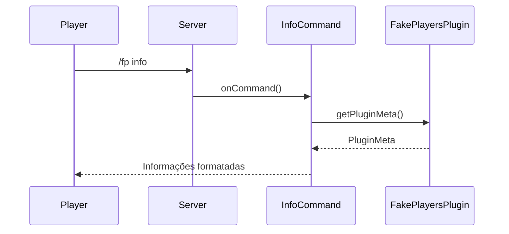
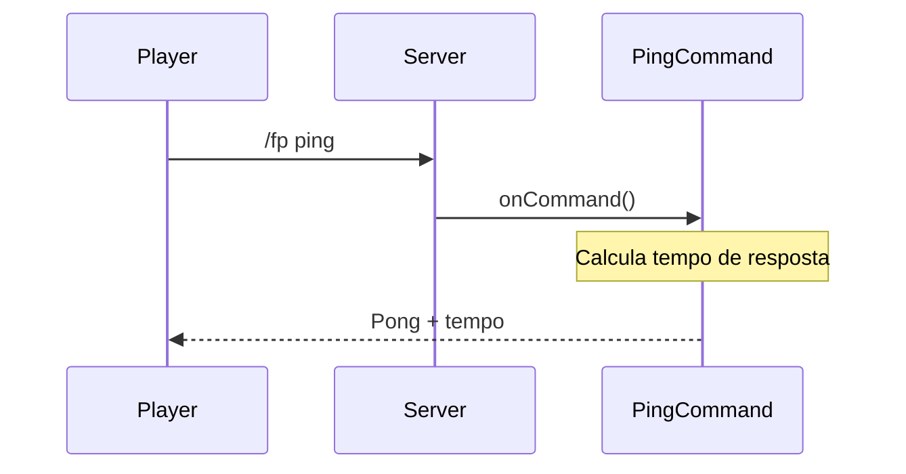
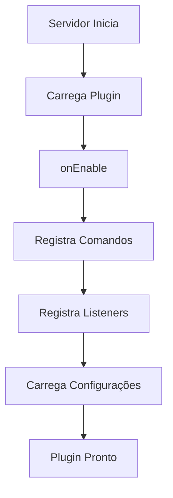

# Documentação Técnica - FakePlayers

## 📚 Referências e Recursos

### Java e Minecraft
- [Documentação Oficial do Java](https://docs.oracle.com/javase/21/docs/)
- [Java Design Patterns](https://refactoring.guru/design-patterns/java)
- [Minecraft Wiki](https://minecraft.fandom.com/wiki/Minecraft_Wiki)
- [Paper API Documentation](https://docs.papermc.io/paper/dev/getting-started)
- [Bukkit API Documentation](https://hub.spigotmc.org/javadocs/bukkit/)

### Ferramentas e Frameworks
- [Gradle Documentation](https://docs.gradle.org/current/userguide/userguide.html)
- [Adventure API Documentation](https://docs.adventure.kyori.net/)
- [Paper Plugin Development](https://docs.papermc.io/paper/dev/getting-started/paper-plugins)

### Boas Práticas
- [Clean Code Principles](https://www.cleancodeconcepts.com/)
- [SOLID Principles](https://www.baeldung.com/solid-principles)
- [Minecraft Plugin Best Practices](https://docs.papermc.io/paper/dev/getting-started/paper-plugins#best-practices)

## 🏗️ Arquitetura do Projeto

### Estrutura de Pacotes
```
app.adriano.fakeplayers/
├── FakePlayersPlugin.java    # Classe principal do plugin
├── commands/                 # Pacote de comandos
│   ├── InfoCommand.java     # Comando de informações
│   └── PingCommand.java     # Comando de teste de latência
└── listeners/               # Pacote de listeners (futuro)
```

### Diagramas de Sequência

#### Comando /fp info


#### Comando /fp ping


### Fluxogramas

#### Fluxo de Execução do Plugin


### Padrões de Design Utilizados
1. **Singleton**: Para a classe principal do plugin
   - Garante uma única instância do plugin
   - Facilita acesso global às configurações
   - Implementado através do `JavaPlugin`

2. **Command Pattern**: Para implementação de comandos
   - Separa a lógica de execução dos comandos
   - Facilita adição de novos comandos
   - Implementa `CommandExecutor` e `TabCompleter`

3. **Observer Pattern**: Para listeners de eventos
   - Permite reação a eventos do servidor
   - Desacopla a lógica de eventos
   - Implementa interface `Listener`

4. **Factory Pattern**: Para criação de Fake Players (futuro)
   - Centraliza a criação de objetos
   - Facilita extensão e manutenção
   - Será implementado na versão 0.2.x

## 🔧 Detalhes Técnicos

### Versões e Dependências
- Java: 21
- Paper API: 1.21.4
- Gradle: 8.x
- Adventure API: 4.x

### Configurações
- `paper-plugin.yml`: Configurações básicas do plugin
- `build.gradle`: Configurações de build e dependências
- `config.yml`: Configurações do plugin (futuro)

### Comandos
- `/fp info`: Mostra informações detalhadas sobre o plugin
- `/fp ping`: Testa a latência do servidor e do plugin
- Mais comandos serão adicionados no futuro

### Permissões
- `fakeplayers.use`: Permissão base para usar comandos
- Mais permissões serão adicionadas no futuro

## 📝 Guia de Manutenção

### Adicionando Novos Comandos
1. Crie uma nova classe em `commands/`
2. Implemente `CommandExecutor` e `TabCompleter`
3. Registre o comando em `FakePlayersPlugin.onEnable()`
4. Adicione documentação e testes

### Adicionando Novos Listeners
1. Crie uma nova classe em `listeners/`
2. Implemente `Listener`
3. Registre o listener em `FakePlayersPlugin.onEnable()`
4. Adicione documentação e testes

### Modificando Configurações
1. Atualize `config.yml`
2. Adicione métodos de getter/setter em `FakePlayersPlugin`
3. Atualize a documentação
4. Teste as mudanças

## 🧪 Testes

### Testes Unitários
- Usar JUnit 5
- Testar cada classe individualmente
- Cobrir casos de sucesso e erro

### Testes de Integração
- Testar interação entre componentes
- Testar com servidor Paper
- Testar com outros plugins

## 🔍 Depuração

### Logs
- Usar `getLogger()` para logs do plugin
- Níveis: INFO, WARNING, SEVERE
- Incluir contexto relevante

### Profiling
- Usar JProfiler ou VisualVM
- Monitorar uso de memória
- Verificar performance

## 📈 Roadmap

### Versão 0.1.x
- [x] Estrutura básica do plugin
- [x] Comandos básicos
- [x] Listener básico (TestListener)
- [ ] Sistema de configuração

### Versão 0.2.x
- [ ] Criação de Fake Players
- [ ] Personalização de aparência
- [ ] Comportamentos básicos

### Versão 0.3.x
- [ ] Sistema de IA
- [ ] Interações complexas
- [ ] API pública

## Funcionalidades

- **Comandos:**
  - `/fp info`: Exibe informações detalhadas sobre o plugin.
  - `/fp ping`: Testa a latência do servidor e do plugin.

- **Listeners:**
  - `TestListener`: Listener básico que registra quando um jogador entra no servidor.

## Estrutura do Projeto

```uml
@startuml
FakePlayersPlugin --> InfoCommand
FakePlayersPlugin --> PingCommand
FakePlayersPlugin --> TestListener
TestListener --|> BaseListener
@enduml
```

## Referências Externas

- [Bukkit API](https://hub.spigotmc.org/javadocs/bukkit/)
- [Paper API](https://papermc.io/javadocs/paper/)
- [Adventure API](https://docs.adventure.kyori.net/)

## Bibliotecas e Frameworks

- **Bukkit/Paper:** Plataforma base para desenvolvimento do plugin.
- **Adventure API:** Manipulação avançada de texto e cores no console e mensagens do jogo. 